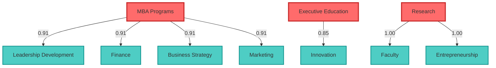

# Topic Hierarchy Report

**Generated:** 2025-11-06 21:51:35

---

## Summary

✅ **Pipeline Status:** COMPLETE

- **Duration:** 0.08 seconds
- **Clusters Created:** 3
- **Average Cluster Size:** 3.33 topics
- **Average Coherence:** 0.733
- **Hierarchy Edges:** 7 CHILD_OF edges
- **Maximum Depth:** 1 levels
- **Average Confidence:** 0.927

## Generated Files

- `docs/topic_hierarchy.mmd` - mermaid
- `docs/cluster_stats.json` - stats

## Topic Hierarchy Visualization

## Next Steps

1. Review topic hierarchy and validate relationships
2. Visualize enriched graph using Mermaid rendering
3. Proceed to next Phase 3 enrichments (NER, personas, etc.)
