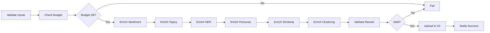

# Deployment Guide - LBS Knowledge Graph

## Table of Contents
1. [Overview](#overview)
2. [Prerequisites](#prerequisites)
3. [Local Development](#local-development)
4. [Production Deployment](#production-deployment)
5. [CI/CD Pipeline](#cicd-pipeline)
6. [Monitoring & Maintenance](#monitoring--maintenance)
7. [Troubleshooting](#troubleshooting)

---

## Overview

This guide covers deploying the LBS Knowledge Graph semantic enrichment system across different environments.

### Architecture Overview

```
┌─────────────────────────────────────────────────────────────┐
│                    GitHub Repository                         │
│  ┌────────────┐  ┌────────────┐  ┌────────────┐            │
│  │ Source     │  │ Workflows  │  │ Data       │            │
│  │ Code       │  │ (.github)  │  │ (S3)       │            │
│  └────────────┘  └────────────┘  └────────────┘            │
└────────────────────────┬────────────────────────────────────┘
                         │
                         ▼
              ┌──────────────────────┐
              │  GitHub Actions      │
              │  CI/CD Pipeline      │
              └──────────┬───────────┘
                         │
          ┌──────────────┼──────────────┐
          │              │              │
          ▼              ▼              ▼
    ┌─────────┐    ┌─────────┐    ┌─────────┐
    │Validate │    │Enrich   │    │Deploy   │
    └─────────┘    └─────────┘    └─────────┘
                         │
                         ▼
                  ┌──────────────┐
                  │  AWS S3      │
                  │  CloudFront  │
                  └──────────────┘
```

---

## Prerequisites

### Required Services

1. **GitHub Repository**
   - Admin access for secrets configuration
   - Actions enabled

2. **LLM API Keys**
   - OpenAI API key (for GPT models)
   - Anthropic API key (optional, for Claude models)

3. **AWS Account** (for production)
   - S3 bucket for data storage
   - IAM credentials with S3 access
   - CloudFront distribution (optional, for CDN)

4. **Neo4j Database** (optional, Phase 1/2)
   - Neo4j Aura or self-hosted instance
   - Connection credentials

### Local Requirements

```bash
# Python 3.11+
python --version

# Required packages
pip install -r requirements.txt

# Environment file
cp .env.example .env
# Edit .env with your API keys
```

---

## Local Development

### 1. Initial Setup

```bash
# Clone repository
git clone <repository-url>
cd lbs-knowledge-graph

# Install dependencies
make install

# Setup project structure
make setup

# Configure environment
cp .env.example .env
# Edit .env with your API keys
```

### 2. Run Enrichment Locally

```bash
# Complete pipeline
make enrich-all

# Individual steps
make enrich-sentiment
make enrich-topics
make enrich-ner
make enrich-personas
make enrich-similarity
make enrich-clustering
```

### 3. Validate Results

```bash
# Run Phase 3 validation
make validate-phase3

# Generate quality report
make quality-report

# Check costs
make cost-report
```

### 4. Testing

```bash
# Run all tests
make test

# Run specific test suites
make test-unit
make test-integration

# Check code quality
make lint
make format
```

---

## Production Deployment

### 1. Configure GitHub Secrets

Navigate to: `Settings > Secrets and variables > Actions`

Add the following secrets:

**Required:**
- `OPENAI_API_KEY` - OpenAI API key
- `AWS_ACCESS_KEY_ID` - AWS access key
- `AWS_SECRET_ACCESS_KEY` - AWS secret key

**Optional:**
- `ANTHROPIC_API_KEY` - Anthropic API key
- `CF_DISTRIBUTION_ID` - CloudFront distribution ID
- `NEO4J_URI` - Neo4j connection URI
- `NEO4J_PASSWORD` - Neo4j password

### 2. Configure AWS Resources

#### S3 Bucket Setup

```bash
# Create S3 bucket
aws s3 mb s3://lbs-kg-content --region us-east-1

# Enable versioning
aws s3api put-bucket-versioning \
  --bucket lbs-kg-content \
  --versioning-configuration Status=Enabled

# Configure CORS (if needed for API access)
aws s3api put-bucket-cors \
  --bucket lbs-kg-content \
  --cors-configuration file://s3-cors.json
```

**s3-cors.json:**
```json
{
  "CORSRules": [
    {
      "AllowedOrigins": ["*"],
      "AllowedHeaders": ["*"],
      "AllowedMethods": ["GET", "HEAD"],
      "MaxAgeSeconds": 3000
    }
  ]
}
```

#### IAM Policy

```json
{
  "Version": "2012-10-17",
  "Statement": [
    {
      "Effect": "Allow",
      "Action": [
        "s3:PutObject",
        "s3:GetObject",
        "s3:ListBucket"
      ],
      "Resource": [
        "arn:aws:s3:::lbs-kg-content/*",
        "arn:aws:s3:::lbs-kg-content"
      ]
    }
  ]
}
```

#### CloudFront Setup (Optional)

```bash
# Create CloudFront distribution for S3 bucket
aws cloudfront create-distribution \
  --origin-domain-name lbs-kg-content.s3.amazonaws.com \
  --default-root-object latest.json
```

### 3. Production Environment File

Create `.env.production` from `.env.production.example`:

```bash
# Copy template
cp .env.production.example .env.production

# Edit with production values
nano .env.production
```

**Key Production Settings:**
```bash
# Higher limits for production
LLM_BATCH_SIZE=100
LLM_MAX_CONCURRENT=10
MAX_LLM_COST=100.00

# Production Neo4j
NEO4J_URI=neo4j+s://production.databases.neo4j.io

# Enable monitoring
ENABLE_METRICS=true
ENABLE_COST_TRACKING=true

# Production logging
LOG_LEVEL=INFO
LOG_FORMAT=json
```

### 4. Deploy to Production

```bash
# Using Makefile
make deploy-prod

# Or manually trigger GitHub Action
gh workflow run enrichment.yml \
  --ref main \
  -f graph_file=lbs-knowledge-graph/data/graph/graph.json \
  -f max_cost=100.00
```

---

## CI/CD Pipeline

### Automated Enrichment Workflow

The pipeline runs automatically on:
- **Manual trigger** (workflow_dispatch)
- **Weekly schedule** (Sunday 2 AM)
- **Push to main** (for production deployments)

### Workflow Stages



### Manual Workflow Trigger

```bash
# Via GitHub CLI
gh workflow run enrichment.yml \
  -f graph_file=lbs-knowledge-graph/data/graph/graph.json \
  -f batch_size=50 \
  -f max_cost=50.00

# Via GitHub UI
# Go to Actions > Enrichment Pipeline > Run workflow
```

### Skipping Steps

To skip specific enrichment steps:

```bash
gh workflow run enrichment.yml \
  -f skip_steps="similarity,clustering"
```

---

## Monitoring & Maintenance

### Cost Monitoring

The cost monitoring workflow runs every 6 hours to track LLM API usage.

**Key Features:**
- Automatic cost tracking
- Budget alerts at 80% threshold
- GitHub issue creation on overages
- Trend analysis

**View Cost Reports:**
```bash
# Generate local report
make cost-report

# View in GitHub Actions
# Go to Actions > Cost Monitoring > Latest run > Artifacts
```

### Log Monitoring

**View Workflow Logs:**
```bash
# List recent workflow runs
gh run list --workflow=enrichment.yml

# View specific run logs
gh run view <run-id> --log
```

**Download Artifacts:**
```bash
# Download enriched graph
gh run download <run-id> -n graph-fully-enriched

# Download validation report
gh run download <run-id> -n validation-report
```

### Data Backups

```bash
# Create backup
make backup

# Restore from backup
make restore
# (Interactive - will prompt for timestamp)

# List backups
ls -la data/backups/
```

### Health Checks

```bash
# Validate graph structure
make validate-phase1

# Validate relationships
make validate-phase2

# Validate enrichments
make validate-phase3

# Complete validation
make validate-all
```

---

## Troubleshooting

### Common Issues

#### 1. Workflow Fails at Budget Check

**Symptom:** Pipeline stops at `check-budget` stage

**Solutions:**
- Check `MAX_LLM_COST` setting in workflow
- Review cost report: `make cost-report`
- Increase budget in workflow dispatch input
- Optimize batch sizes to reduce costs

#### 2. LLM API Rate Limits

**Symptom:** 429 errors in enrichment logs

**Solutions:**
```bash
# Reduce concurrent requests
LLM_MAX_CONCURRENT=3

# Reduce batch size
LLM_BATCH_SIZE=25

# Add retry logic (already implemented)
LLM_MAX_RETRIES=5
```

#### 3. S3 Upload Fails

**Symptom:** `upload-to-s3` job fails

**Solutions:**
- Verify AWS credentials in GitHub Secrets
- Check S3 bucket permissions
- Ensure bucket exists: `aws s3 ls s3://lbs-kg-content`
- Review IAM policy

#### 4. Validation Failures

**Symptom:** `validate-enrichments` job fails

**Solutions:**
```bash
# Run validation locally
make validate-phase3

# Check specific validators
python src/validation/sentiment_validator.py
python src/validation/topic_validator.py
python src/validation/ner_validator.py

# Review validation report
cat validation_report.json
```

#### 5. Out of Memory Errors

**Symptom:** Process killed during enrichment

**Solutions:**
```bash
# Reduce batch size
LLM_BATCH_SIZE=25

# Process graph in chunks
python scripts/enrich_sentiment.py \
  --graph data/graph/graph.json \
  --batch-size 25 \
  --chunk-size 1000

# Use streaming mode (if available)
python scripts/full_pipeline.py --streaming
```

### Debug Mode

Enable detailed logging:

```bash
# Set in .env
LOG_LEVEL=DEBUG
ENABLE_PROFILING=true

# Run with verbose output
python scripts/full_pipeline.py --verbose
```

### Getting Help

1. **Check Documentation:**
   - [API Reference](API_REFERENCE.md)
   - [Phase 3 Status](PHASE_3_STATUS.md)
   - [Test Reports](PHASE_3_TEST_REPORT.md)

2. **Review Logs:**
   ```bash
   # GitHub Actions logs
   gh run view --log

   # Local logs
   tail -f logs/enrichment.log
   ```

3. **Open an Issue:**
   - Include workflow run ID
   - Attach relevant logs
   - Describe expected vs actual behavior

---

## Rollback Procedures

### Rollback Enriched Graph

```bash
# From S3 versioned backup
aws s3 cp \
  s3://lbs-kg-content/graph/versions/<timestamp>.json \
  s3://lbs-kg-content/graph/latest.json

# From local backup
make restore
# Select backup timestamp when prompted
```

### Rollback Workflow Changes

```bash
# Revert workflow file
git revert <commit-hash>
git push origin main

# Or restore from previous version
git checkout <previous-commit> -- .github/workflows/enrichment.yml
git commit -m "Rollback workflow changes"
git push origin main
```

---

## Performance Optimization

### Batch Size Tuning

**Small Graphs (< 1000 nodes):**
```bash
LLM_BATCH_SIZE=50
LLM_MAX_CONCURRENT=5
```

**Medium Graphs (1000-10000 nodes):**
```bash
LLM_BATCH_SIZE=100
LLM_MAX_CONCURRENT=10
```

**Large Graphs (> 10000 nodes):**
```bash
LLM_BATCH_SIZE=200
LLM_MAX_CONCURRENT=20
```

### Cost Optimization

**Use Cheaper Models:**
```bash
# For non-critical tasks
LLM_MODEL=gpt-3.5-turbo  # Instead of gpt-4

# For simple tasks
LLM_MODEL=claude-3-haiku-20240307  # Instead of claude-3-opus
```

**Enable Caching:**
```bash
LLM_CACHE_ENABLED=true
LLM_CACHE_TTL=86400  # 24 hours
```

---

## Security Best Practices

1. **Never commit secrets** to repository
2. **Use GitHub Secrets** for all credentials
3. **Rotate API keys** regularly (90 days recommended)
4. **Use least-privilege IAM policies**
5. **Enable MFA** on all accounts
6. **Monitor API usage** for anomalies
7. **Review workflow logs** regularly
8. **Use branch protection** rules for main branch

---

## Maintenance Schedule

### Daily
- Monitor workflow runs
- Check cost reports
- Review error logs

### Weekly
- Review validation reports
- Analyze cost trends
- Update dependencies

### Monthly
- Rotate API keys
- Clean up old artifacts
- Review and optimize performance
- Update documentation

### Quarterly
- Security audit
- Disaster recovery test
- Performance benchmarking
- Architecture review

---

## Additional Resources

- **GitHub Actions Docs:** https://docs.github.com/en/actions
- **AWS S3 Best Practices:** https://docs.aws.amazon.com/s3/
- **OpenAI API Docs:** https://platform.openai.com/docs
- **Anthropic API Docs:** https://docs.anthropic.com/

---

## Appendix

### Example Deployment Commands

```bash
# Complete deployment workflow
git checkout main
git pull origin main
make test
make validate-all
make backup
make deploy-prod

# Monitor deployment
gh run list --workflow=enrichment.yml
gh run watch

# Verify deployment
aws s3 ls s3://lbs-kg-content/graph/latest.json
```

### Useful GitHub CLI Commands

```bash
# Trigger workflow with custom parameters
gh workflow run enrichment.yml \
  -f graph_file=custom/path/graph.json \
  -f batch_size=100 \
  -f max_cost=75.00 \
  -f skip_steps="clustering"

# View workflow status
gh run watch

# Download all artifacts
gh run download <run-id>

# View workflow file
gh workflow view enrichment.yml --web
```

---

**Last Updated:** 2025-11-06
**Version:** 1.0.0
**Maintained by:** LBS Knowledge Graph Team
